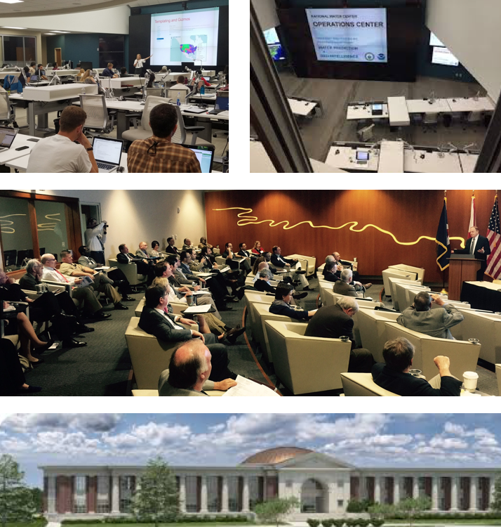
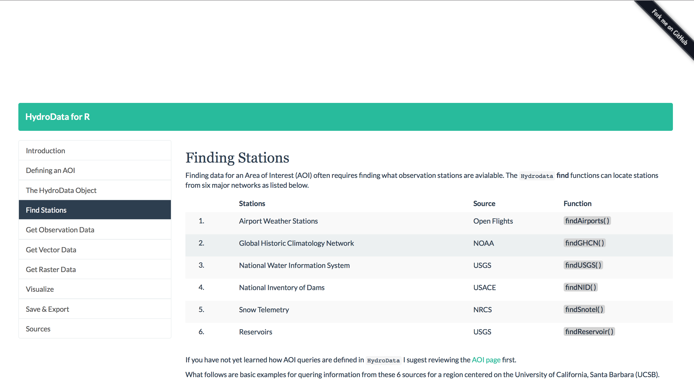
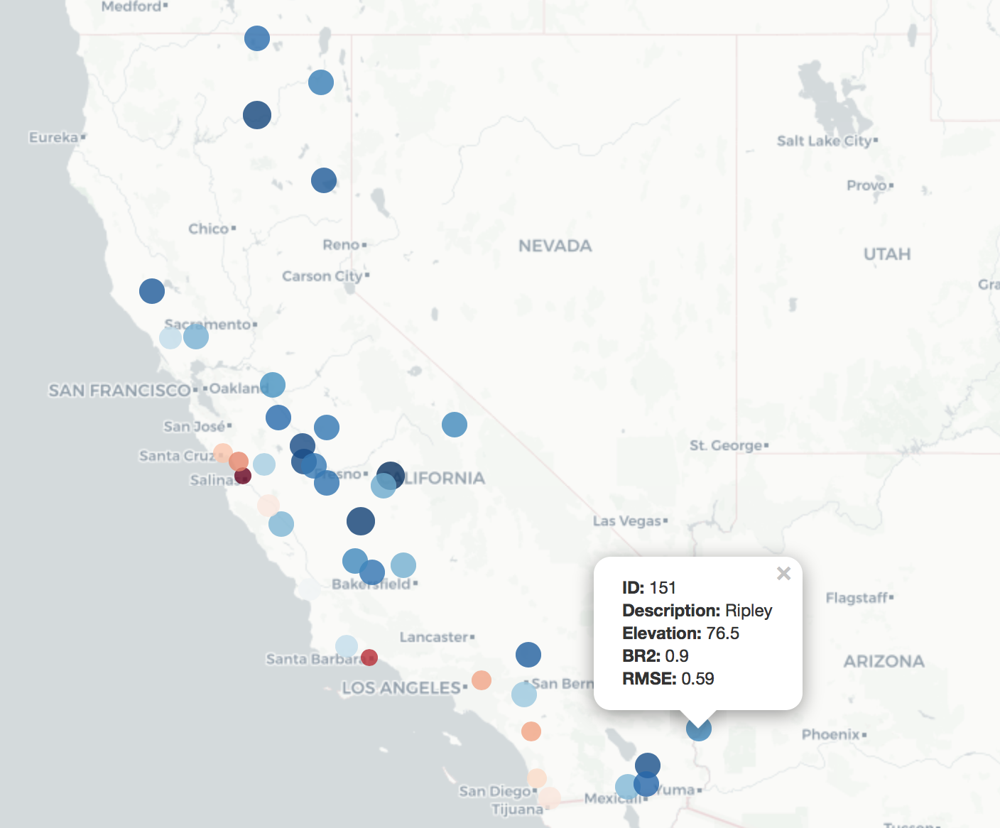
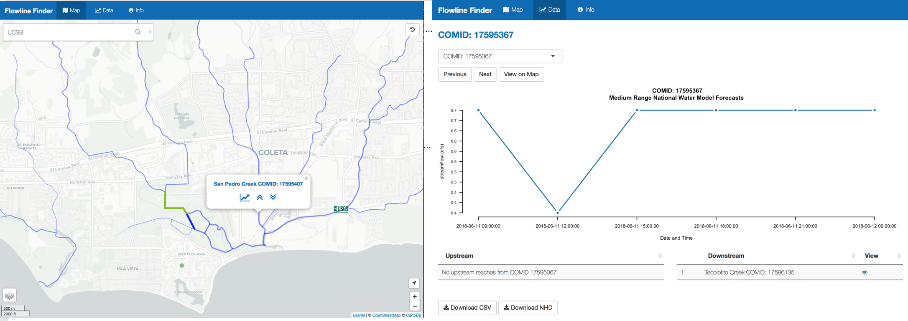
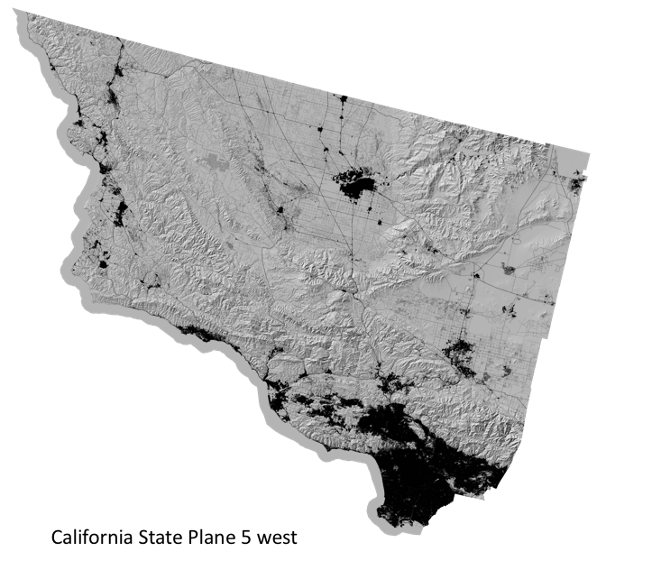
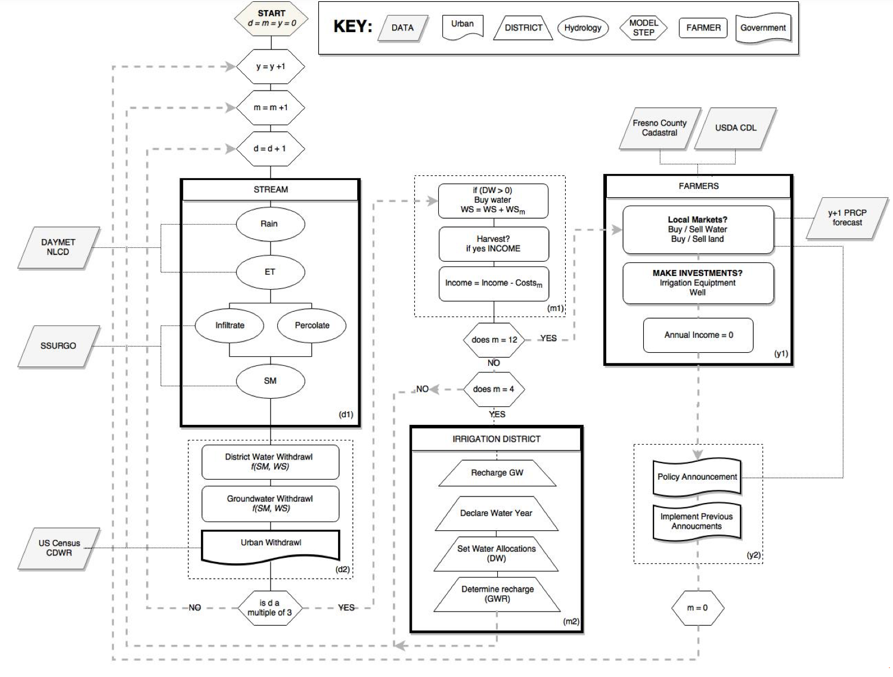
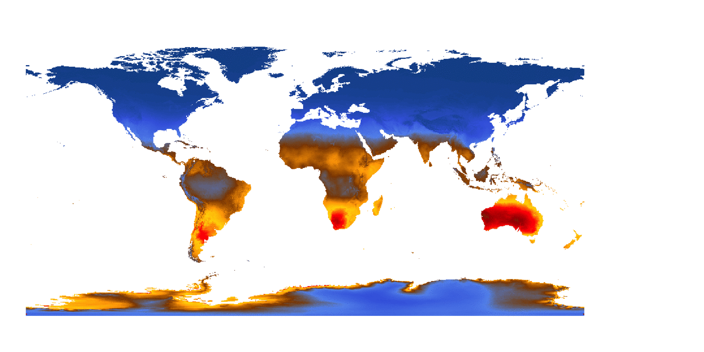

  

# Clarke Lab 2018 Photo
***

 
<left>

</left>
 
 

# Travel
***

### Tuscaloosa, Alabama

  Summer 2017: Research Coordinator @ NOAA's National Water Center

 
<left>

</left>
 
 

### Amsterdam, Netherlands

Winter of 2018: Visiting Researcher at the VU Amsterdam. 

 

 
 

# Packages
***

Over the last year several packages and applications have been developed. Most are available on Github:

### HydroData

[Documentation site](http://mikejohnson51.github.io/HydroData/)

HydroData is an R package designed to help users find, get, visualize and use a range of Earth Systems data for a defined Area of Interest. The package provides functions to automatically download data, in a consistent format, from 19 sources focused on spatial and observation data through a consistent query. Further, it helps interactively visualize and share data within R and/or a browser; and export data for external use in GIS, python, or other applications.

 
 

 
 

### Evapotraspiration

**Working with:** Dami Eyelade & Dino Korac

The Evapotranspiration package serves to model potential and actual evapotranspiration using DAYMET, WeatherUnderground, and NLCD data as inputs. `HydroData` facilitates data access, the model algorithm was developed to synthesize these inputs, and the land cover coefficients for Anderson level II land cover classifications were developed using MODIS 16 products.

 
 

 
 

### NWM Client

The National Water Model (NWM) client is supported by UCARs COMET program. It helps access, format, subset NWM forecasts stored on the HydroShare and NOMADs servers for an area of interest.

### FlowlineFinder

[README](https://github.com/mikejohnson51/FlowlineFinder)

**Working with:** [Pat Johnson](http://pjohns.github.io/pjohns)

This project is a continuation of the 'FlowlineFinder' demonstrated at the CUASHI 2017 [HydroInformatics Conference](https://www.cuahsi.org/uploads/pages/img/2017_Hydroinformatics_Program_-_Online_Version.pdf) in Tuscaloosa, AL. Its intention is to help users find, view and download NHD and National Water Model Data from either a desktop or mobile application. Of particular interest is the ability to find nearby NHD reaches in the field. Much of the data processing and gathering is driven by the [HydroData](http://mikejohnson51.github.io/HydroData/) and NWM packages with a interface driven by R Shiny.

 
 

 
 

# Papers
***

1. **Johnson, JM**, Jim M. Coll, Paul J. Ruess, and Jordan T. Hastings, **2018**. *Challenges and Opportunities for Creating Intelligent Hazard Alerts: The “FloodHippo” Prototype*. Journal of the American Water Resources Association (JAWRA) 1–10. https://doi.org/10.1111/1752-1688.12645

2. Loaiciga, HA,  **Johnson, JM**, **2018**. *Infiltration on sloping terrain and its role on runoff generation and slope stability*. Journal of Hydrology ISSN 0022-1694, https://doi.org/10.1016/j.jhydrol.2018.04.023.

3. **Johnson JM**, Loaiciga HA. **2017**. *Coupled infiltration and kinematic-wave runoff simulation in slopes: implications for slope stability*. Water 9(5). doi:10.3390/w9050327

4. **Johnson JM**, Coll J M, et al. **2017**. *National Water Centers Innovators Program Summer Institute Report. Consortium of Universities for the Advancement of Hydrologic Science, Inc*. Technical Report 14 doi:10.4211/technical.20171009

# In Progress
***

5. **Johnson JM**, Clarke KC **(prepping for resubmission)**. *The Five Meanings of Water Security*. Journal of Hydrology.

6. Wens M, **Johnson JM**, Zagaria C, Veldkamp TIE. **(ready to submit)**. *Improving Drought Risk Modeling: An agent-based approach*. WIREs Water.

### California SLEUTH Application

Keith Clarke is leading the implementation of a large scale (state of California), high-resolution (30 meter) application of SLEUTH. The first draft of this data subdivided into 8 regions has been completed

 
 

 
 

### Drought risk Agent-based Modeling (Kerman City)

While in Amsterdam a small scale agent-based model was developed to better understand the dynamics between climate and ground water with drawls in an agricultural area near Fresno, CA. The framework has been setup and the model runs.

 
 

 
 

### Global 1 km Evapotranspiration Modeling

Using WorldClim monthly data and the algorithm of the `Evapotransipiration` package a global climatology of PET has been constructed.

 
 

 
 

### USA streamflow thresholds

**Working with:** Helen Chen

Condensing a 23 hourly run of the National Water Model to daily, monthly, and annual values offers the opportunity to develop low and high threshold values for each and every stream reach in the continental United States. By defining a set of thresholds for each reach, a high and low benchmark (10% tails of FDC and Q ratings) each new forecast can be compared and subset with respect to these thresholds. The remaining reaches are those that demand computational attention for flood mapping and drought monitoring. 

Further it offers an opportunity to better study: 

  (1) where the NWM preforms well and poorly (Compared to the NWIS)
  (2) how stream dynamics change across space and time 
  (3) how the HAND flood mapping technique can be refined
  
 
 

# Summer 2018 
***

### Boulder, Colorado

**NCAR lab:** Connecting SLEUTH (time-varying land covers) to the NWM @ the NCAR RAL

  
  
  

***

[Github](https://github.com/mikejohnson51") - [ReseracherGate](https://www.researchgate.net/profile/Mike_Johnson29) - [Google Scholar](https://scholar.google.com/citations?hl=en&user=MrXM9cgAAAAJ&view_op=list_works&sortby=pubdate) - [Website](https://mikejohnson51.github.io)

